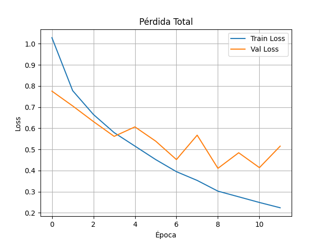
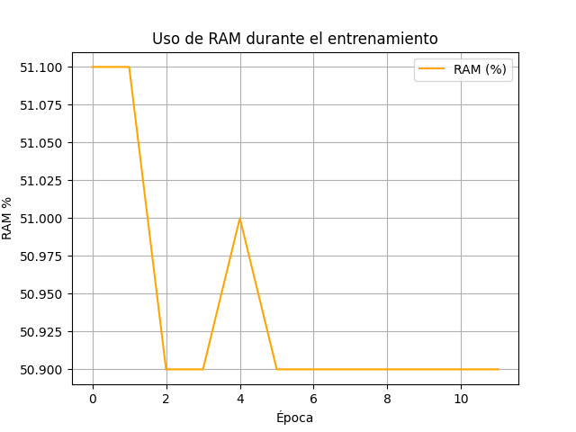
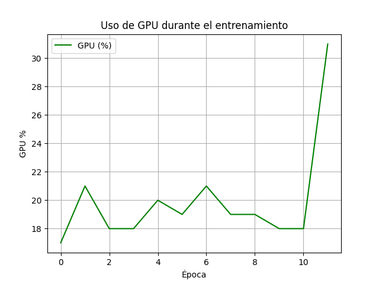
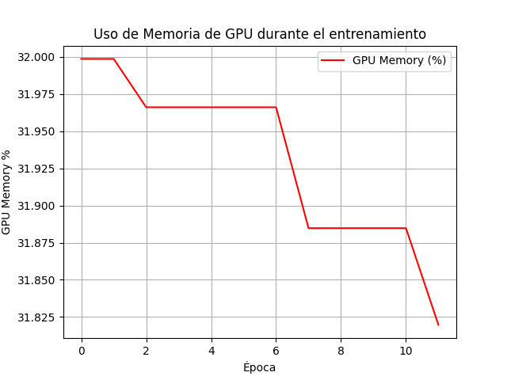
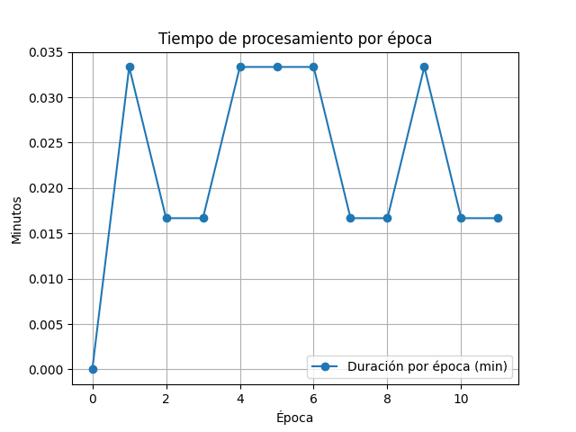

# ?? Resultados del Entrenamiento del Modelo de Clasificación de Hate Speech

A continuación se presentan las gráficas obtenidas durante el entrenamiento del modelo de clasificación, que detecta mensajes ofensivos, de odio o neutros.

---

## ?? Precisión de Clasificación

Esta gráfica muestra cómo mejoró la **precisión** del modelo en cada época, tanto para entrenamiento como validación:

---

## ?? Pérdida Total

Aquí se visualiza la **pérdida (loss)** en ambas fases. Una pérdida más baja indica mejor aprendizaje:

---

## ??? Uso de Recursos del Sistema

Se registraron métricas del sistema para monitorear el consumo durante el entrenamiento:

### CPU

---

### RAM

---

### GPU

---

### Memoria de GPU

---

## ?? Duración por Época

Cada época del entrenamiento tomó aproximadamente entre 1 y 2 segundos:

---

## ? Conclusiones

- El modelo muestra una mejora progresiva sin signos de sobreajuste.
- El uso de recursos fue estable y eficiente.
- Puede ejecutarse en equipos con recursos moderados (CPU y GPU básica).
